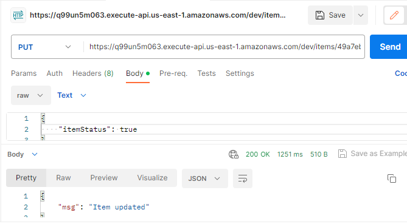

<h1><b>Deploying Infra as Code in AWS with Serverless Framework</b></h1>
<h2><b>Objective</b></h2>
Deploy services to Create, Read, Update and Delete (CRUD) items in a DynamoDB table, through Node.js API endpoints, over AWS Lambda functions, using the Serverless Framework.
<h2><b>About Serverless Framework</b></h2>
"The Serverless Framework pioneered serverless architecture on AWS, a transformative approach to building applications on cloud infrastructure that auto-scales, incurs no charges when idle, and typically demands minimal maintenance. Today, it continues to be the leading developer tool for deploying serverless architectures."  
"The Serverless Framework helps you develop and deploy AWS Lambda functions, along with the AWS infrastructure resources they require. It's a CLI that offers structure, automation and best practices out-of-the-box, allowing you to focus on building sophisticated, event-driven, serverless architectures, comprised of Functions and Events." 

<h3><b>Key concepts of Serverless Framework</b></h3>

1. <b>Functions</b>: The code of a serverless application is deployed and executed in AWS Lambda functions. 
2. <b>Events</b>: Functions are triggered by events, that come from other AWS resources, for example, an HTTP request on an API Gateway. 
3. <b>Resources</b>: Resources are AWS infrastructure components used by the functions, such as a DynamoDB table, for example. 
4. <b>Services</b>: A service is an unit of organization. A service is configured via a file called <u>serverless.yml</u>, where you define your functions, events and resources. 

<a href="https://www.serverless.com/framework/docs" target="_blank">See Serverless Framework Documentation</a>

<h2><b>Requirements</b></h2>

<h3><b>AWS account</b></h3>

It´s necessary to have an account, created in the AWS IAM with programmatic access, with the right permissions to access the resources used in the project. For this exercise, I´ll use an account with administrative access, but this is not the best practice.

<h3><b>Node.js installed</b></h3>

<a href="https://nodejs.org/en" target="_blank">See Node.js Documentation</a>

<h3><b>Serverless framework installed</b></h3>

> npm i -g serverless

<h3><b>The code</b></h3>

The code was developed by Cassiano Peres, and it´s available at: <a href="https://github.com/cassianobrexbit/dio-live-serverless-2907/tree/master/src" target="_blank">GitHub Repository</a>

<h3><b>The serverless.yml file</b></h3>

The serverless.yml file contains all the specifications necessary to create the AWS resources and deploy the Lambda Functions.

<h4><b>Specify the resources (in this case, the DynamoDB table):</b></h4>

<h4><b>Give access over DynamoDB for Lambda functions:</b></h4>

<h4><b>For each function, specify the name, the handler, the path and the method associated:</b></h4>

<h3><b>Postman installed</b></h3>

To test the API, install Postman. See:   <a href="https://www.postman.com/downloads/" target="_blank">Postman download</a>

<h2><b>Step by Step Execution</b></h2>

1. Copy the source code for the functions, from the GitHub repository.
2. Create an access key in the AWS IAM console and use with the <i>AWS configure</i> command (in the terminal).

3. Create the <i>serverless.yml</i> file.
4. Install the SDK and its dependencies:

> npm install aws-sdk

This command installs the SDK for JavaScript and updates the package.json to list the SDK as a project dependency.

5. Install the uuid module:

> npm install uuid

6. Run the command to create the project:

   > serverless

7. Run the command to deploy:
   
   > serverless deploy

    - the first time you run, the endpoints, the functions and the DynamoDB table will be created.

 

 

 

    
    - but, it´s necessary to copy the DynamoDB table ARN identifier and paste it into the <i>serverless.yml</i>, and run the deploy again, to give access for the functions.

8. Run tests using Postman:

- Post a new item:

- See the item created in the AWS DynamoDB console:

   
- Access the Get Items endpoint:

- Access an Item by Id:

- Update an Item:

9. Remove all functions, resources and services:

> serverless remove

